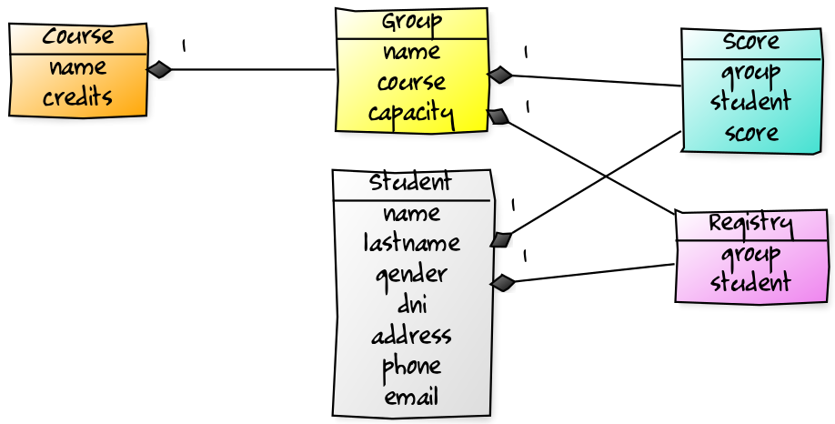
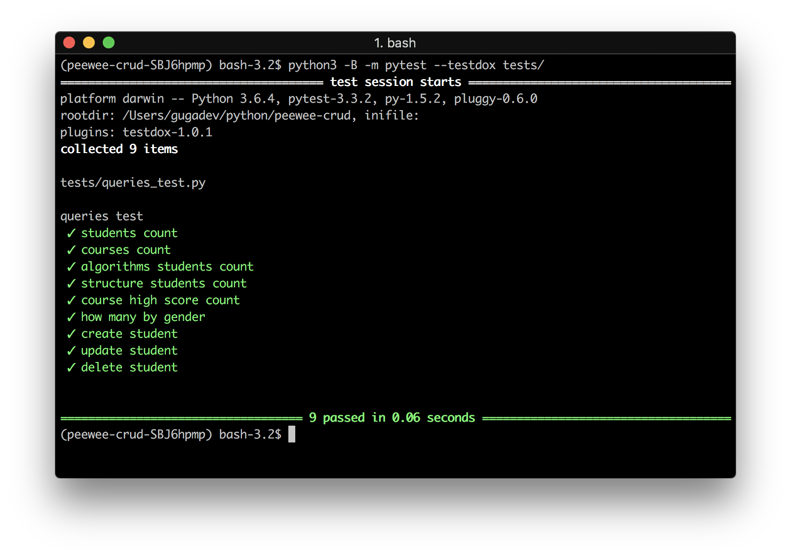

<h1 align="center">Peewee CRUD</h1>

Este repositorio contiene el código fuente para el [tutorial](https://gugadev.wordpress.com) publicado en mi blog.

La idea de este tutorial es realizar una introducción al concepto de ORM y al uso de Peewee como ORM para Python.


### Entidades

El siguiente diagrama muestra las entidades a construir. Cada una de estas entidades representará a una tabla en la base de datos.

<p align="center"></p>

### Ejecución

Primero debemos ejecutar el archivo `app.py` para crear la base de datos y hacer las inserciones iniciales. En este fichero puede verse la parte de inserción mediante los modelos Peewee.

Para comprobar que las consultas realizadas en el archivo `tests/queries.test` devuelven los datos esperados, ejecutar:

```python
python3 -B -m pytest --testdox tests/
```

Esto ejecutará el test de consultas mostrándonos cuáles han pasado y cuáles han fallado:

<p align="center"></p>